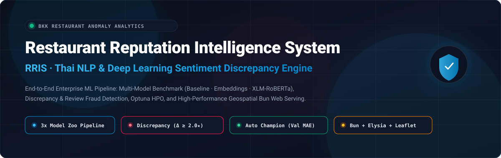
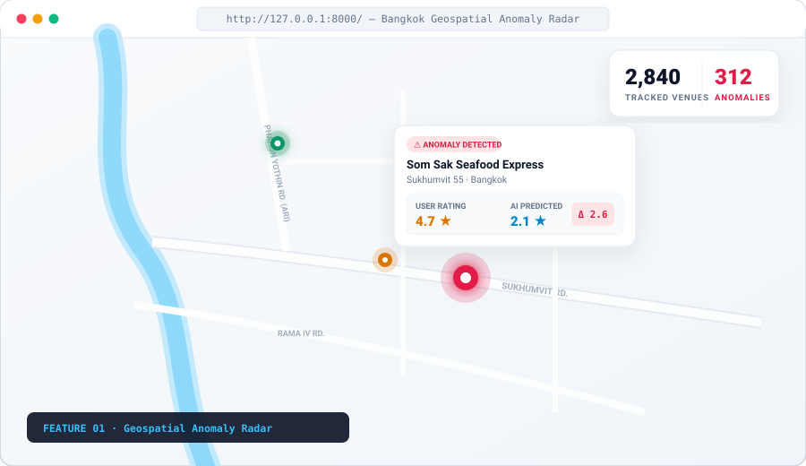
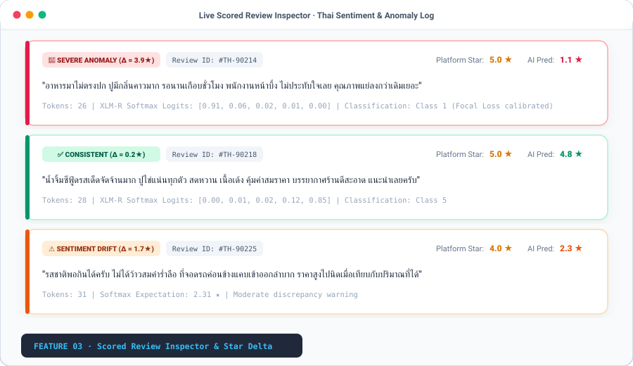
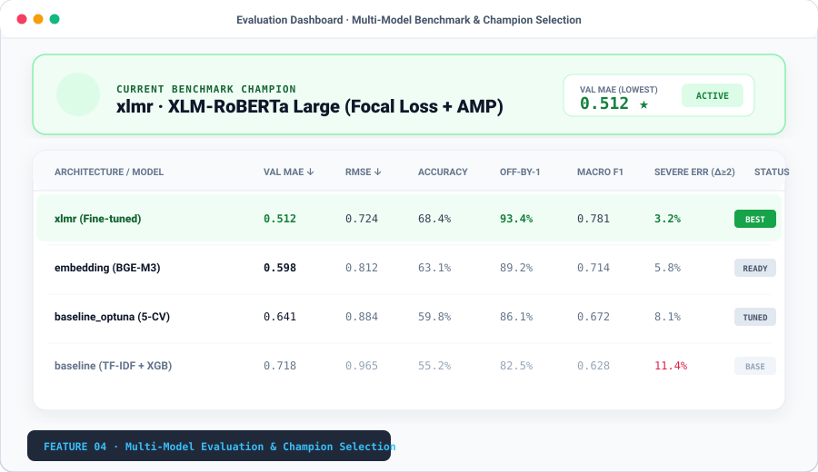
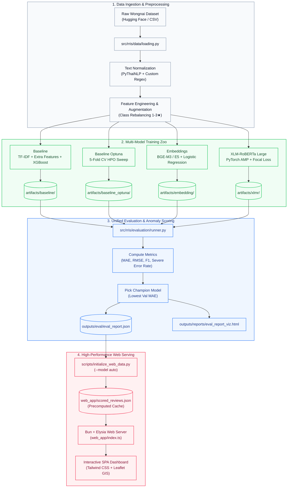

<div align="center">



<br/><br/>

[](https://www.python.org/)
[](https://pytorch.org/)
[](https://bun.sh/)
[](https://huggingface.co/)
[](https://xgboost.readthedocs.io/)
[](https://optuna.org/)
[](LICENSE)

<br/>

**An enterprise-grade, end-to-end Machine Learning intelligence system designed to detect sentiment discrepancies, rating anomalies, and restaurant review fraud in Thai language text.**

[Key Features](#-interface-preview--feature-deep-dive) • [Architecture](#-system-architecture) • [Quick Start](#-quick-start-guide) • [Model Zoo](#-model-zoo--benchmarks) • [CLI Commands](#-cli-reference) • [Experiments](#-experimentation--hyperparameter-tuning) • [Directory Guide](#-repository-structure)

</div>

---

## 📌 Executive Overview

In the restaurant and hospitality ecosystem, online star ratings are heavily vulnerable to review inflation, bot farms, and malicious review bombing. The **Restaurant Reputation Intelligence System (RRIS)** addresses this vulnerability by deploying state-of-the-art Deep Learning and Natural Language Processing (NLP) models specifically calibrated for **Thai text**.

RRIS operates on a continuous feedback loop:
1. **Reads & Tokenizes** customer review text in Thai using specialized morphological tokenizers (`PyThaiNLP`).
2. **Predicts Expected Sentiment Ratings** ($\mathbb{E}[R] \in [1.0, 5.0]$) by computing softmax-weighted expectation values across class logits.
3. **Identifies Anomalies & Fraud** by calculating the divergence ($\Delta = |y_{\text{user}} - \mathbb{E}[R]|$). Any review with $\Delta \ge 2.0\star$ is automatically flagged as a **Severe Discrepancy**.
4. **Delivers Operational Intelligence** through an interactive geospatial analytics map powered by **Bun + Elysia (TypeScript)** and **Leaflet GIS**.

---

## 🔍 Interface Preview & Feature Deep Dive

Experience how RRIS translates complex NLP model inference into intuitive, actionable reputation intelligence:

### 1. Geospatial Anomaly Radar & Hotspot Map
> *Interactive real-time map displaying tracked restaurant venues across Bangkok with visual anomaly severity indicators.*

<div align="center">
  
</div>

- **Dynamic Clustering & Glow Pins:** Green pins designate authentic, low-variance venues; amber pins signal moderate drift; pulsing red pins pinpoint high-discrepancy venues where platform ratings conflict heavily with AI text sentiment.
- **Real-Time HUD Counter:** Instant visibility over tracked venues, active anomaly counts, and city-wide divergence statistics.
- **Instant Venue Inspection:** Click any marker or use the autocomplete search bar to pull full NLP diagnostics.

---

### 2. Sentiment Discrepancy & Reputation Fraud Card
> *Side-by-side comparison of claimed platform ratings against deep-learning sentiment expectation.*

<div align="center">
  
</div>

- **Dual-Metric Divergence:** Compares the raw platform star rating (e.g., $4.7\star$) directly against the AI expected rating (e.g., $2.1\star$).
- **Automated Fraud Alert Banner:** Triggers when the mean absolute divergence exceeds the threshold ($\Delta \ge 2.0\star$), alerting platform operators and consumers to potential review manipulation.
- **Statistical Aggregation:** Shows total reviews scored, anomaly percentage, and maximum detected delta.

---

### 3. Live Scored Review Stream & Error Inspector
> *Granular review-level sentiment breakdown with Thai tokenization diagnostics and class probabilities.*

<div align="center">
  
</div>

- **Sub-Text Inspection:** Evaluates Thai text semantics directly (e.g., detecting negative critique disguised under a 5-star rating).
- **Logit & Softmax Transparency:** Displays token count, model logits, and classification confidence for every individual review.
- **Categorization Badges:** Automatically tags logs as `SEVERE ANOMALY (Δ ≥ 2.0★)`, `SENTIMENT DRIFT`, or `CONSISTENT / VERIFIED`.

---

### 4. Multi-Model Evaluation & Production Champion Benchmark
> *Head-to-head model comparison matrix with automated production champion selection.*

<div align="center">
  
</div>

- **Automated Champion Selection:** The pipeline automatically identifies the best performing model based on **Lowest Validation MAE** and promotes it to production (`--model auto`).
- **Comprehensive Metric Suite:** Compares Validation MAE, RMSE, Off-by-one Accuracy, Macro F1, and Severe Error Rate ($\Delta \ge 2.0$).
- **Transparent Benchmarking:** Compare TF-IDF Baseline, Sentence Embeddings, and Fine-Tuned Transformers side-by-side.

---

## 🏗 System Architecture

RRIS is engineered as a decoupled, reproducible Machine Learning pipeline encompassing data engineering, training, offline evaluation, and low-latency web serving.



---

## 🤖 Model Zoo & Benchmarks

RRIS provides 3 distinct model architectures to balance compute budget against predictive fidelity:

| Architecture | Strategy | Target Framework | Primary Strength |
| :--- | :--- | :--- | :--- |
| **`baseline`** | TF-IDF (1-3 n-grams) + Linguistic Features + XGBoost | CPU / GPU (`hist`) | Extremely fast training (<2 min), low latency inference, high interpretability. |
| **`baseline_optuna`** | Automated Bayesian Optimization over XGBoost hyperparameters | 5-Fold Cross Validation | Maximizes tree depth, learning rate, and regularizers systematically. |
| **`embedding`** | Pre-trained Multilingual Sentence Transformers (`BGE-M3` / `multilingual-e5-base`) + Classifier Head | PyTorch + Scikit-Learn | Captures deep semantic meaning without fine-tuning full LLM weights. |
| **`xlmr`** | Fine-tuned `XLM-RoBERTa Large` with Class-Weighted **Focal Loss** + **AMP** | PyTorch + Hugging Face | State-of-the-art Thai sentiment comprehension; handles class imbalance natively. |

### Mathematical Anomaly Formulation

For classification heads predicting class probabilities $\mathbf{p} = [p_1, p_2, p_3, p_4, p_5]$ where $\sum_{k=1}^5 p_k = 1$:

$$\mathbb{E}[R] = \sum_{k=1}^{5} k \cdot p_k$$

The absolute star divergence is defined as:

$$\Delta = \left| y_{\text{actual}} - \mathbb{E}[R] \right|$$

$$\text{Anomaly Flag} = \begin{cases} 
1 & \text{if } \Delta \ge \tau_{\text{anomaly}} \quad (\tau = 2.0\star) \\
0 & \text{otherwise}
\end{cases}$$

---

## 🚀 Quick Start Guide

### Prerequisites
- **Python:** `3.10` or higher
- **Bun runtime:** `1.1+` ([bun.sh](https://bun.sh/))
- **GPU (Optional):** NVIDIA GPU with CUDA support. *(For RTX 50-series Blackwell architecture, use PyTorch with CUDA 12.8).*

### Step 1: Clone & Initialize Environment

```powershell
# Clone the repository
git clone https://github.com/01aptx01/Restaurant-Reputation-Intelligence-System.git
cd Restaurant-Reputation-Intelligence-System

# Create and activate Python virtual environment
python -m venv .venv
.\.venv\Scripts\Activate.ps1

# Install dependencies
pip install -r requirements.txt
pip install -e .
```

> **Note for NVIDIA RTX 50-Series (sm_120 / Blackwell):**
> ```powershell
> pip install --pre torch torchvision torchaudio --index-url https://download.pytorch.org/whl/nightly/cu128 --upgrade
> ```

---

### Step 2: Prepare Dataset

You can download the real-world **Wongnai Review Dataset** from Hugging Face, or generate mock data for an immediate smoke test:

```powershell
# Option A: Real-World Dataset (Recommended)
python scripts/download_wongnai.py

# Option B: Quick Mock Dataset (Smoke Test)
python scripts/generate_mock_data.py
```

---

### Step 3: Train Models

Train any or all of the production models using the unified CLI:

```powershell
# Train the fast baseline XGBoost model
python -m rris train baseline

# Train the sentence embedding classifier
python -m rris train embedding

# Train the deep XLM-RoBERTa Large model
python -m rris train xlmr

# (Optional) Run Optuna hyperparameter tuning
python -m rris train baseline_optuna
```

---

### Step 4: Run Unified Evaluation

Evaluate all trained models against the holdout set and generate benchmarking reports:

```powershell
# Evaluate all models and pick champion
python -m rris evaluate --model all --output outputs/eval/eval_report.json

# Generate interactive HTML visualization report
python -m rris visualize --input outputs/eval/eval_report.json --output outputs/reports/eval_report_viz.html
```

---

### Step 5: Launch Web Application

Initialize the web cache with the best model and launch the Bun server:

```powershell
# 1. Install frontend & Bun dependencies
cd web_app
bun install
cd ..

# 2. Score dataset using the champion model (auto-selected by Val MAE)
python scripts/initialize_web_data.py --model auto

# 3. Start high-performance Elysia server
bun run web_app/index.ts
```

Open **[http://127.0.0.1:8000](http://127.0.0.1:8000)** in your browser to explore the dashboard.

---

## 💻 CLI Reference

RRIS exposes entry points via standard `python -m rris` commands:

| Command | Arguments & Options | Description |
| :--- | :--- | :--- |
| `python -m rris train` | `<baseline \| embedding \| xlmr \| baseline_optuna>` | Train a specific model and save artifacts to `artifacts/<model>/`. |
| `python -m rris evaluate` | `--model <all \| baseline \| embedding \| xlmr>`<br/>`--output <path.json>`<br/>`--export-errors` | Runs holdout evaluation, computes full metrics suite, and exports severe anomalies. |
| `python -m rris score` | `--model <model_name>`<br/>`--input <path.csv>`<br/>`--output <path.csv>` | Scores unlabelled reviews, returning expected rating and anomaly flags. |
| `python -m rris visualize` | `--input <eval_report.json>`<br/>`--output <report.html>` | Compiles an interactive Plotly HTML report visualizing model benchmarks. |

---

## 🔬 Experimentation & Hyperparameter Tuning

RRIS includes a research-grade experimentation engine supporting manifest-driven sweeps and ablation studies:

```powershell
# 1. Run hyperparameter sweep using YAML manifest
python scripts/run_experiments.py experiments/manifests/baseline_sweep.yaml
python scripts/run_experiments.py experiments/manifests/xlmr_sweep.yaml

# 2. Run targeted ablation studies
python experiments/embedding_model_ablation.py
python experiments/baseline_feature_ablation.py --cv 3
python experiments/xlmr_preprocess_ablation.py --epochs 1

# 3. Compare and rank all experiment runs
python experiments/compare_results.py
```

All experiment outputs are tracked under `experiments/results/` with deterministic run IDs and hyperparameter diffs.

---

## 📂 Repository Structure

```text
Restaurant-Reputation-Intelligence-System/
├── README.md                      # Primary documentation & project showcase
├── LICENSE                        # MIT License
├── pyproject.toml                 # Python package configuration (PEP 621)
├── requirements.txt               # Locked production dependencies
│
├── src/rris/                      # Core RRIS Python package
│   ├── config.py                  # Global settings, paths, and anomaly thresholds
│   ├── data/                      # Data loaders, tokenization & feature engineering
│   │   ├── loading.py             # Dataset loader & stratified split
│   │   ├── text.py                # Thai text normalization (PyThaiNLP)
│   │   └── features.py            # Linguistic extra features extractor
│   ├── training/                  # Model training implementations
│   │   ├── baseline.py            # TF-IDF + XGBoost trainer
│   │   ├── embedding.py           # Sentence Transformer trainer
│   │   └── xlmr.py                # XLM-RoBERTa Large trainer (AMP + Focal Loss)
│   ├── evaluation/                # Evaluation & metric calculators
│   │   ├── metrics.py             # MAE, RMSE, F1, and Anomaly metrics
│   │   ├── selection.py           # Model selection algorithms (lowest MAE)
│   │   └── runner.py              # Unified evaluation execution engine
│   ├── inference/                 # High-throughput batch inference
│   └── cli/                       # CLI commands (train, eval, score, viz)
│
├── web_app/                       # Low-latency web application
│   ├── index.ts                   # Bun + Elysia server backend
│   ├── templates/index.html       # Single Page Application (SPA) dashboard
│   ├── static/                    # Tailwind CSS styles & Leaflet GIS scripts
│   └── scored_reviews.json        # Precomputed cached inference outputs
│
├── scripts/                       # Operational utility scripts
│   ├── download_wongnai.py        # Hugging Face Wongnai downloader
│   ├── generate_mock_data.py      # Mock dataset generator for smoke tests
│   ├── augment_data.py            # Synthetic review balance generator
│   ├── initialize_web_data.py     # Production cache preparation script
│   └── run_experiments.py         # Manifest-driven experiment runner
│
├── experiments/                   # Research & experimentation suite
│   ├── manifests/                 # YAML sweep configurations
│   ├── results/                   # JSON outputs from experiment runs
│   └── compare_results.py         # Benchmark ranker & comparison CLI
│
├── docs/                          # Detailed technical documentation
│   ├── assets/                    # SVG banners and feature preview graphics
│   ├── getting-started.md         # Extended installation guide
│   ├── evaluation.md              # Metric definitions & anomaly math
│   ├── directory-guide.md         # Comprehensive directory handbook
│   └── summary.md                 # Full system executive briefing
│
└── tests/                         # Unit tests & smoke test verification
    ├── test_smoke.py
    └── test_predict_roundtrip.py
```

---

## 🧪 Testing & Quality Assurance

Verify system integrity using the built-in test suite:

```powershell
# Run smoke tests
$env:RRIS_SMOKE = "1"
python scripts/generate_mock_data.py
pytest tests/ -q

# Test roundtrip prediction consistency
pytest tests/test_predict_roundtrip.py -v
```

---

## 📄 License

This project is licensed under the **MIT License** — see the [LICENSE](LICENSE) file for details.

```text
MIT License
Copyright (c) 2026 01aptx01 / Restaurant Reputation Intelligence System Contributors
```

---

<div align="center">
  <sub>Built with precision for reliable, transparent, and AI-powered reputation intelligence.</sub>
</div>
