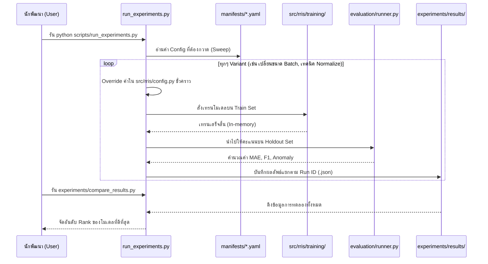

# สรุปภาพรวมโปรเจกต์ Restaurant Reputation Intelligence System (RRIS)

**Restaurant Reputation Intelligence System (RRIS)** คือระบบวิเคราะห์ความน่าเชื่อถือของรีวิวร้านอาหารจากข้อความภาษาไทย โดยระบบจะทำหน้าที่อ่านข้อความรีวิวแล้วทำนาย (Predict) คะแนนดาว (1-5 ดาว) เพื่อนำไปเปรียบเทียบกับดาวที่ผู้ใช้ให้จริง หากมีความคลาดเคลื่อนสูง (Anomaly) ระบบจะแจ้งเตือนหรือจับความผิดปกติได้

โปรเจกต์นี้ถูกออกแบบมาในลักษณะ **End-to-End Machine Learning Pipeline** ที่ครอบคลุมตั้งแต่การจัดการข้อมูล, การฝึกสอนโมเดล (Training), การประเมินผล (Evaluation), การทดลอง (Experimentation) ไปจนถึงการนำโมเดลไปใช้งานบน Web Application

---

## 1. โมเดล (Machine Learning Models)
ระบบรองรับการทำงานกับโมเดล 3 รูปแบบหลัก เพื่อเปรียบเทียบประสิทธิภาพและความเร็ว:

1. **`baseline` (TF-IDF + XGBoost)**
   - **แนวคิด:** ใช้เทคนิคดั้งเดิมคือแปลงข้อความเป็นเวกเตอร์ด้วย TF-IDF ควบคู่กับการสกัดฟีเจอร์เพิ่มเติม (Extra features เช่น ความยาวข้อความ, จำนวนคำเฉพาะ) แล้วใช้โมเดล XGBoost Classifier ในการทำนาย
   - **ข้อดี:** เทรนไว, ใช้ทรัพยากรน้อย, ตีความได้ง่าย
   - มีโหมด `baseline_optuna` สำหรับใช้ Optuna ในการค้นหา Hyperparameter ที่ดีที่สุด (Sweep) ผ่าน 5-fold Cross Validation

2. **`embedding` (Sentence Embeddings + Classifier)**
   - **แนวคิด:** ใช้โมเดล Pre-trained ฝั่ง Sentence Transformer (เช่น E5, BGE-M3, MiniLM) เพื่อแปลงข้อความรีวิวทั้งประโยคให้เป็นเวกเตอร์ที่มีความหมาย (Dense Vector) จากนั้นนำเวกเตอร์ไปเข้า Classifier (เช่น Logistic Regression หรือ XGBoost)
   - **ข้อดี:** เข้าใจบริบทของประโยคได้ดีกว่า TF-IDF โดยไม่ต้องเสียเวลา Fine-tune โมเดลภาษาทั้งก้อน

3. **`xlmr` (XLM-RoBERTa Fine-tuning)**
   - **แนวคิด:** นำโมเดลภาษาขนาดใหญ่ที่รองรับหลายภาษา (XLM-RoBERTa) มาทำ Fine-tuning โดยตรงกับชุดข้อมูลรีวิว
   - **เทคนิคที่ใช้:** มีการใช้ AMP (Automatic Mixed Precision) เพื่อให้เทรนเร็วขึ้น และใช้ Focal Loss เพื่อจัดการกับปัญหา Imbalanced Data (เช่น รีวิว 1 ดาว หรือ 2 ดาวมีน้อยกว่า 4-5 ดาว)
   - **ข้อดี:** ประสิทธิภาพและความแม่นยำมักจะสูงที่สุดเพราะโมเดลเข้าใจภาษาไทยเชิงลึก

---

## 2. การประมวลผลข้อมูล (Data Pipeline & Preprocessing)
ระบบมี Scripts อัตโนมัติสำหรับการดึงและจัดการข้อมูล
- **Dataset:** ใช้ข้อมูลรีวิวจาก Wongnai เป็นหลัก (`scripts/download_wongnai.py`) และสามารถสร้าง Mock data สำหรับทำ Smoke test ได้
- **Text Normalization:** มีระบบจัดการข้อความภาษาไทย (`src/rris/data/text.py`) ผ่านฟังก์ชัน `resolve_normalize_func` เพื่อทำความสะอาดข้อความ ลบอักขระพิเศษ หรือตัดคำ (Tokenization)
- **Data Augmentation:** มีระบบสร้างข้อมูลสังเคราะห์ (`scripts/augment_data.py`) เพื่อเพิ่มจำนวนข้อมูลในคลาสที่มีน้อย (เช่น ดาว 1-3) ทำให้โมเดลไม่ลำเอียง

---

## 3. การประเมินผล (Evaluation & Model Selection)
หลังจากเทรนโมเดลเสร็จ ระบบมี Pipeline สำหรับวัดผลอย่างละเอียด:
- **Metrics หลัก:** ประเมินความแม่นยำด้วย **MAE (Mean Absolute Error)** เป็นหลัก นอกจากนี้ยังมี RMSE, Accuracy, และ F1-Score
- **Anomaly Detection:** มีเมตริกวัดความผิดปกติ เช่น `severe_error_rate` (ทายผิดเกิน 2 ดาว)
- **Auto Selection:** ระบบสามารถบันทึกผลการประเมินลงใน `outputs/eval/eval_report.json` และมีระบบ **Auto Model Selection** ที่จะเลือกโมเดลที่ได้ค่า MAE ต่ำที่สุดบน Validation Set ไปใช้ใน Web Application อัตโนมัติ

---

## 4. ระบบการทดลอง (Experimentation Framework)
โปรเจกต์นี้มีสถาปัตยกรรมรองรับการทำวิจัยและทดลอง (R&D) อย่างเป็นระบบ:
- **Manifest-driven (YAML):** ใช้ไฟล์ YAML ในโฟลเดอร์ `experiments/manifests/` เพื่อกำหนดค่าพารามิเตอร์ของแต่ละ Variant สำหรับทำ Grid/Random Sweep
- **Ablation Studies:** มี Script แยกสำหรับรันทดสอบแยกส่วน เช่น ทดสอบเฉพาะ Preprocessing, เปรียบเทียบ Embedding Models หลายๆ ตัว, หรือเทียบ Feature pipeline
- **ผลลัพธ์:** เมื่อรันผ่าน `scripts/run_experiments.py` ผลลัพธ์จะถูกจัดเก็บแยกรอบการรัน (Run ID) สามารถใช้ `compare_results.py` เพื่อแรงค์ (Rank) และหา Config ที่ดีที่สุดได้

---

## 5. Web Application
นำผลลัพธ์ที่ได้ไปแสดงผลให้ผู้ใช้ทั่วไปดูผ่าน Web UI ที่ Interactive:
- **Backend:** ทำงานด้วย **Bun + Elysia (TypeScript)** (`web_app/index.ts`) ซึ่งทำหน้าที่เป็น Web Server เสิร์ฟหน้าเว็บและ API
- **Data Init:** ก่อนเปิดเว็บจะมีการรัน `scripts/initialize_web_data.py --model auto` เพื่อทำนายคะแนนรีวิวสำหรับชุดข้อมูลเตรียมไว้ และบันทึกเป็น `scored_reviews.json` (Caching)
- **Frontend / Dashboard:** หน้าเว็บแสดงผลแบบ SPA (Single Page Application) มีการใช้แผนที่ (Leaflet) ในการพล็อตร้านอาหาร และแสดงความน่าเชื่อถือของรีวิว (ว่ามี Anomaly เยอะแค่ไหน)

---

## 6. โครงสร้างโปรเจกต์และไฟล์ที่สำคัญ (Directory Structure)

```text
Restaurant-Reputation-Intelligence-System/
├── README.md              ← หน้าแรกของโปรเจกต์
├── pyproject.toml         ← ตั้งค่า Package และ Dependencies ฝั่ง Python
├── requirements.txt       ← รายการ Dependencies ที่ต้องติดตั้ง
│
├── src/rris/              ← แกนหลักของระบบ (Python Package)
│   ├── config.py          ← ตั้งค่าตัวแปร, Path, Hyperparameters กลาง
│   ├── data/              ← จัดการข้อมูล (โหลด, ทำความสะอาด, สร้าง Features)
│   ├── evaluation/        ← การประเมินผล (คำนวณ Metrics, หา Best Model)
│   ├── inference/         ← การนำโมเดลไปทำนายผล (Score/Predict)
│   ├── training/          ← โค้ดฝึกสอนโมเดล (baseline, embedding, xlmr)
│   ├── visualization/     ← โค้ดสร้างกราฟ (Plotly HTML)
│   └── cli/               ← Command Line Interface (`python -m rris`)
│
├── scripts/               ← สคริปต์สำหรับทำงาน One-off แบบรันครั้งเดียว
│   ├── download_wongnai.py    ← ดึงข้อมูล Wongnai Dataset จาก Hugging Face
│   ├── generate_mock_data.py  ← สร้าง Mock Data สำหรับทดสอบระบบ (Smoke test)
│   ├── augment_data.py        ← เติมข้อมูลดาว 1-3 ให้สมดุล
│   ├── initialize_web_data.py ← เตรียมข้อมูลสำหรับก่อนนำขึ้นเว็บ
│   └── run_experiments.py     ← รันทดลอง (Sweep) ตามไฟล์ Manifest
│
├── web_app/               ← โค้ดส่วน Web Application
│   ├── index.ts           ← Elysia server (Backend + API)
│   ├── templates/         ← หน้า HTML หลัก (SPA)
│   ├── static/js/         ← โค้ดฝั่ง Frontend (Leaflet, Dashboard)
│   └── scored_reviews.json← ไฟล์ผลทำนาย (Cache) สำหรับแสดงบนเว็บ
│
├── experiments/           ← การทดลองโมเดลและวิจัย (R&D)
│   ├── manifests/         ← ไฟล์ YAML ตั้งค่า Sweep พารามิเตอร์ต่างๆ
│   ├── results/           ← โฟลเดอร์เก็บผลการทดลองแบบแยก Run ID
│   ├── compare_results.py ← โค้ดสำหรับเปรียบเทียบผลทดลองและ Rank
│   └── *_ablation.py      ← สคริปต์ทดสอบ Ablation แยกส่วน
│
├── docs/                  ← โฟลเดอร์เก็บเอกสารคู่มือ (Markdown)
│   ├── getting-started.md ← คู่มือติดตั้งและเริ่มใช้งาน
│   ├── evaluation.md      ← นิยามของ Metrics ต่างๆ
│   └── directory-guide.md ← คู่มือโฟลเดอร์แบบเต็ม
│
├── data/                  ← โฟลเดอร์เก็บข้อมูลจริง (CSV) มักถูกละเว้นใน Git
├── artifacts/             ← โฟลเดอร์เก็บน้ำหนักโมเดล (Weights) หลังเทรน
└── outputs/               ← โฟลเดอร์เก็บผลลัพธ์ (คะแนน, ไฟล์ Report JSON/HTML)
```

## 7. สรุป Workflow การทำงาน
1. **เตรียมสภาพแวดล้อม (Env):** สร้าง Python venv, ติดตั้ง dependencies
2. **โหลดข้อมูล (Data):** รันโหลดไฟล์ Wongnai หรือ Mock data
3. **สอนโมเดล (Train):** ใช้คำสั่ง `python -m rris train <model_name>` เพื่อสอนโมเดลและบันทึก Artifact
4. **ประเมิน (Evaluate):** คำสั่ง `python -m rris evaluate --model all` เพื่อเปรียบเทียบและหาผู้ชนะ (Best Model)
5. **แสดงผลเว็บ (Deploy):** แปลงข้อมูลผ่าน `initialize_web_data.py` แล้วสตาร์ทเซิร์ฟเวอร์ด้วย `bun run web_app/index.ts`

---

## 8. แผนภาพแสดงการทำงานและการดึงข้อมูล (Data Flow & Execution)

### 8.1 แผนภาพ Data Pipeline & Web Deployment (ภาพรวมทั้งระบบ)

```mermaid
flowchart TD
    %% 1. Data Preparation Phase
    subgraph Data Pipeline [1. การจัดการและเตรียมข้อมูล]
        A[scripts/download_wongnai.py] -->|ดึงข้อมูลจาก Hugging Face| B[(data/wongnai/)]
        B -->|โหลดและแยก Train/Test| C[src/rris/data/loading.py]
        C -->|ทำความสะอาดข้อความ| D[src/rris/data/text.py]
        D -->|เพิ่มฟีเจอร์/สังเคราะห์ข้อมูล| E[src/rris/data/features.py]
    end

    %% 2. Training Phase
    subgraph Training Phase [2. การฝึกสอนและประเมินผล]
        E -->|ข้อมูลพร้อมเทรน| F{เลือกโมเดล}
        
        F -->|python -m rris train baseline| G[training/baseline.py]
        F -->|python -m rris train embedding| H[training/embedding.py]
        F -->|python -m rris train xlmr| I[training/xlmr.py]
        
        G -->|Save Weights| J[artifacts/baseline/]
        H -->|Save Weights| K[artifacts/embedding/]
        I -->|Save Weights| L[artifacts/xlmr/]
        
        J & K & L --> M[evaluation/runner.py]
        M -->|python -m rris evaluate| N[outputs/eval/eval_report.json]
    end

    %% 3. Web Deployment Phase
    subgraph Web Deployment [3. นำขึ้น Web Application]
        N -.->|อ่านหา Best Model (MAE ต่ำสุด)| O[scripts/initialize_web_data.py]
        O -->|ทำนายผลและสร้าง Cache| P[(web_app/scored_reviews.json)]
        P -->|โหลดข้อมูลเตรียมเสิร์ฟ| Q[web_app/index.ts]
        Q -->|Elysia API Response| R[web_app/static/js/dashboard.js]
        R -->|Render UI / Leaflet Map| S[Browser]
    end
    
    classDef file fill:#f9f2f4,stroke:#c7254e,stroke-width:1px,color:#c7254e;
    class A,C,D,E,G,H,I,M,O,Q,R file;
```

### 8.2 แผนภาพระบบทดลอง (Experimentation & Sweep Workflow)


